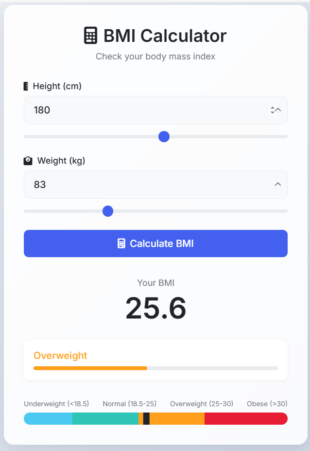

# BMI Calculator

 

A responsive web application that calculates Body Mass Index (BMI) with visual feedback. Built with pure HTML, CSS, and JavaScript.

## Features

- **Dual Input Controls**: Text fields + interactive sliders
- **Instant Calculation**: Real-time BMI computation
- **Visual Results**:
  - Color-coded BMI categories
  - Interactive chart with position marker
  - Progress bar visualization
- **Responsive Design**: Works on all devices
- **Input Validation**: Prevents invalid submissions

## Tech Stack

- **Frontend**: HTML5, CSS3, JavaScript (ES6)
- **Styling**: Glassmorphism design with CSS variables
- **No Dependencies**: Pure vanilla JS implementation

## Installation

1. Clone the repository:
```bash
git clone https://github.com/shoaib-solangi/BMI---Calculator.git
